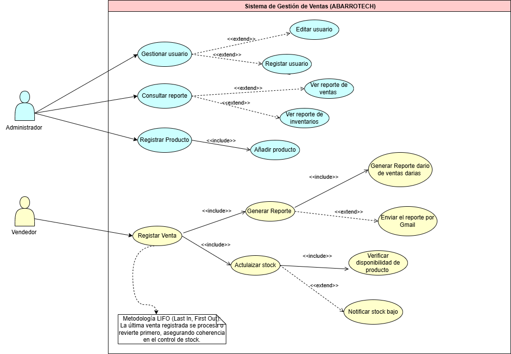
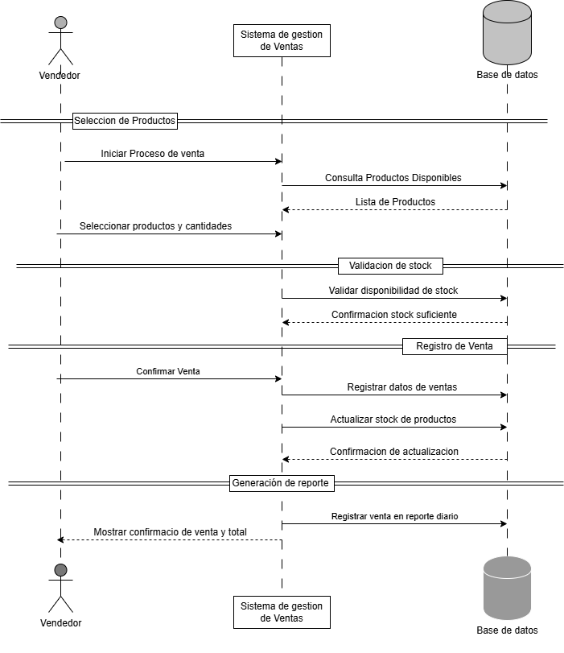
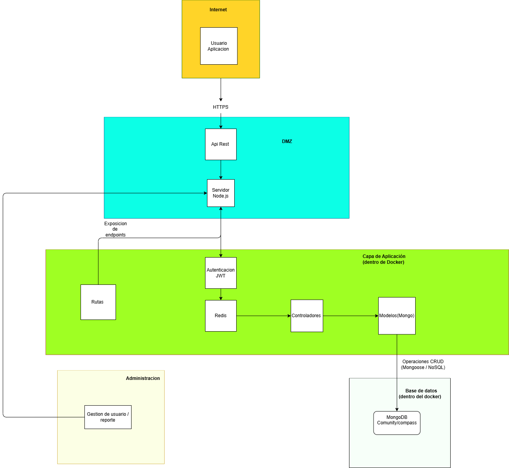
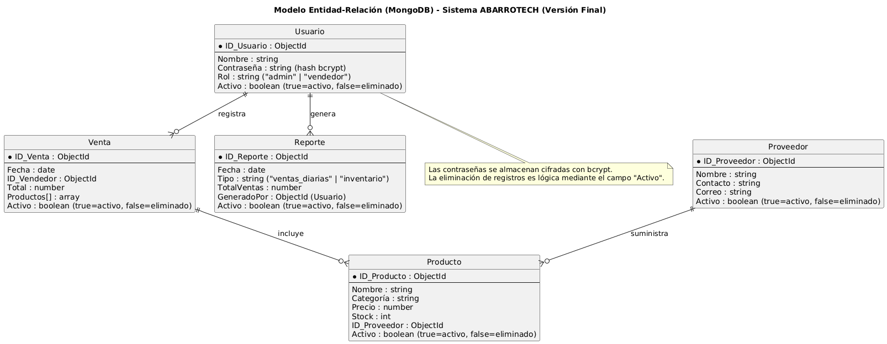
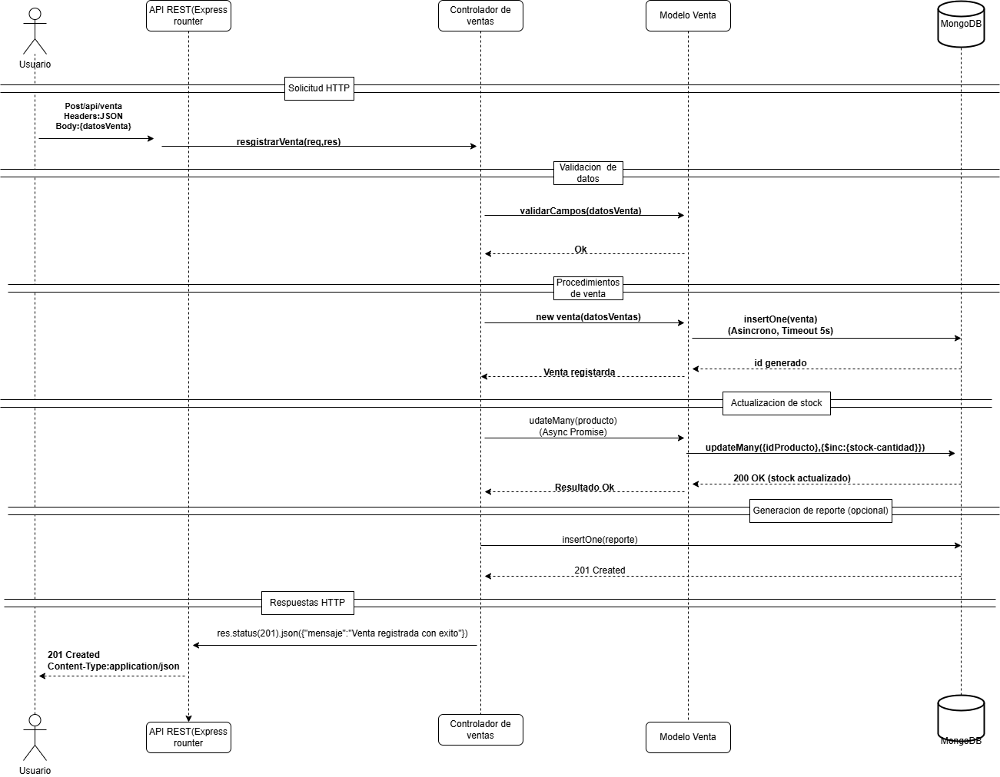
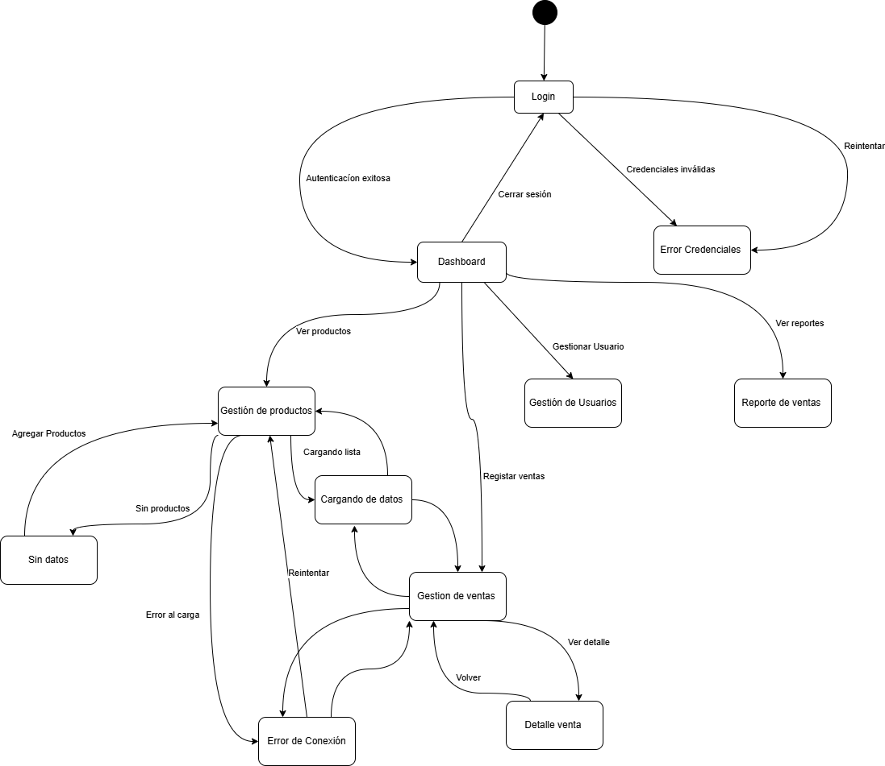

# Informe de Diseño Lógico y Técnico  
## Sistema de Gestión – ABARROTECH  

**Integrantes:** Felipe Astete, Michael Flores, Nicolas Huenchual, Roberto Villouta  
**Fecha:** 20/11/2025  
**Sección:** 01  
**Profesor:** Michael Campos  
**Asignatura:** Base de Datos II

--

#### 1.Introducción

### Objetivo
Desarrollar un sistema informático para tiendas de abarrotes que centralice la información, automatice la gestión de productos, ventas y stock, y mejore la toma de decisiones mediante reportes y control de usuarios.

### Alcance
- Registro y control de productos y stock  
- Registro de ventas (metodología LIFO)  
- Gestión de usuarios (administrador y vendedor)  
- Reportes simples de ventas

--

#### 2. DEFINICIONES Y ACRÓNIMOS

### Definiciones y Acrónimos
- **API RESTful:** Comunicación cliente-servidor vía HTTP  
- **JWT:** JSON Web Token  
- **CRUD:** Crear, Leer, Actualizar, Eliminar  
- **MVP:** Producto Mínimo Viable  

--

#### 3. DESCRIPCIÓN GENERAL

ABARROTECH es un sistema que utiliza Node.js, MongoDB y Redis para automatizar la gestión de tiendas de abarrotes.  
Opera bajo arquitectura REST y puede desplegarse localmente o con Docker.

### Usuarios y Roles
- Administrador  
- Vendedor  
- Cliente (futuro)

--

#### 4. REQUISITOS FUNCIONALES

## Gestión de productos
CRUD completo y control de stock.

## Registro de ventas
Actualiza stock usando metodología LIFO.

## Control de usuarios
Autenticación con roles.

## Reportes
Resumen de ventas por fecha y totales.

--

### 6. DIAGRAMAS FUNCIONALES

### Caso de uso

### Flujo de Registrar Venta

### Diagrama de Secuencia

## 7. Requisitos No Funcionales

- *Respuesta menor a 3 segundos*

- Cifrado con bcrypt

- Autenticación con JWT

- Interfaz usable y clara

- Implementación mediante Docker

- Escalabilidad para múltiples usuarios concurrentes

## 8. Interfaces del Sistema

- Interfaces externas

- MongoDB

- Redis

- Docker

- Interfaces de usuario

- Panel web para administradores y vendedores

# 9. Validación y Criterios de Aceptación

- Las funcionalidades se validarán mediante pruebas unitarias y de integración con Insomnia/Postman.

- Criterios de aceptación

- CRUD funcional

- Stock actualizado en tiempo real

- Contraseñas cifradas

- JWT válido para sesiones

# Diseño Técnico – ABARROTECH

## 1. Arquitectura General
El sistema utiliza una arquitectura por capas:

- **Node.js + Express** como API REST  
- **MongoDB** como base de datos  
- **Redis** para caché  
- **Docker** para despliegue y contenedores  

### Metodología LIFO
El inventario usa **LIFO (Last In, First Out)** para descontar productos, funcionando como una pila: las unidades más nuevas salen primero.

---

## 2. Base de Datos (MongoDB)

Colecciones principales:

- `productos`  
- `proveedores`  
- `usuarios`  
- `ventas`  
- `detalles_venta`  

### Reglas de diseño:
- IDs únicos  
- Eliminación lógica (estado activo/inactivo)  
- Contraseñas cifradas con bcrypt  

---

## 3. Módulos Técnicos

| Módulo / Archivo | Función |
|------------------|---------|
| `productController.js` | CRUD de productos |
| `salesController.js` | Registro de ventas + LIFO |
| `userController.js` | Registro, login y JWT |
| `reportService.js` | Generación de reportes |

---
## 8. Diagrama de Interfaz de Usuario (UI)

Este módulo representa las pantallas principales del sistema y cómo interactúa el usuario con la aplicación.

Pantallas consideradas:

- **Login:** acceso de administradores y vendedores.  
- **Panel principal:** resumen del estado de la tienda.  
- **Gestión de productos:** listado, edición y creación de productos.  
- **Registro de ventas:** proceso de venta rápida con actualización de stock (LIFO).  
- **Reportes:** visualización de ventas por fecha y totales.

### Diagrama de Interfaz (referencial)
 

---

## 4. Seguridad

- Autenticación mediante **JWT**  
- Contraseñas cifradas con **bcrypt**  
- Validación en todos los endpoints  
- Comunicación segura vía **HTTPS** en producción  

---

## 5. Pruebas Técnicas

- **Unitarias:** Jest  
- **Integración:** Insomnia / Postman  
- Validación de rutas REST (GET, POST, PUT, DELETE)  
- Prueba de lógica de stock (LIFO)  

---

## 6. Requisitos del Sistema

**Software:** Node.js, MongoDB, Redis, Docker  
**Hardware mínimo:** 2 CPU, 4 GB RAM  

---

## 7. Mantenimiento y Escalabilidad

- Código modular y mantenible  
- Control de versiones con GitHub  
- Escalabilidad horizontal mediante contenedores Docker adicionales  